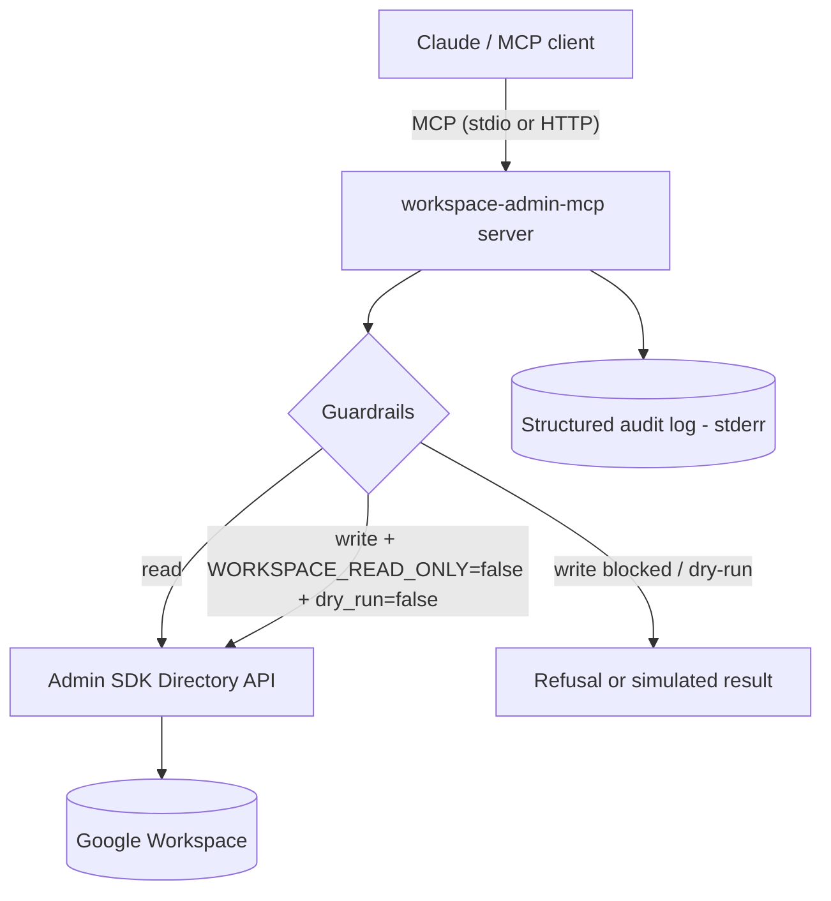

# Architecture

## Overview

`workspace-admin-mcp` exposes Google Workspace **admin/directory** operations to
an LLM through the Model Context Protocol. It is deliberately small and
safety-first: reads are open, writes are gated.

## Request lifecycle

1. The MCP client calls a tool (e.g. `workspace_suspend_user`).
2. The tool records an audit entry and checks guardrails:
   - `WORKSPACE_READ_ONLY=true` (default) → the write is **refused**.
   - Writes enabled but `dry_run` (default) → the action is **simulated**.
   - Writes enabled and `dry_run=false` → the action is **applied**.
3. Read tools call the Admin SDK directly and return compact JSON summaries.
4. Every call — refused, simulated, or applied — emits one JSON audit line to
   stderr (stdout is reserved for the MCP protocol).

## Design choices

- **Safety by default.** Admin actions can suspend accounts, so the server
  starts read-only and simulates writes until explicitly told otherwise.
- **Compact summaries.** The Admin SDK returns large objects; tools trim them to
  the fields that matter so LLM context stays cheap and readable.
- **Injectable client.** `build_server(settings, client)` takes the directory
  client as a parameter, so tests run against an in-memory fake — no
  credentials, no network.
- **Lazy Google imports.** `google-*` libraries are imported only when a real
  API call is made, keeping import and test time fast.

## Layout

| Path | Responsibility |
|------|----------------|
| `config.py` | Environment-driven settings |
| `auth.py` | Admin SDK client + response summarizers |
| `safety.py` | Read-only / dry-run guardrails |
| `audit.py` | Structured JSON audit logging |
| `tools/users.py` | User lifecycle tools |
| `tools/groups.py` | Group membership tools |
| `server.py` | Assembles the FastMCP server |
